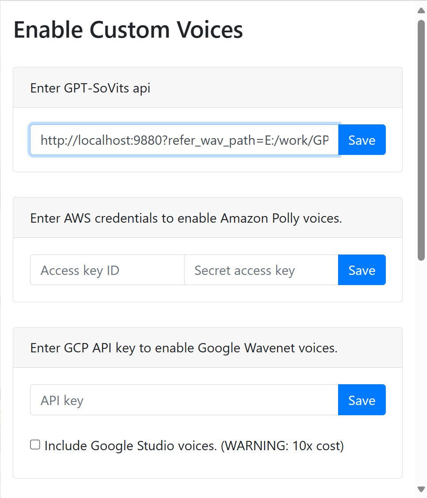
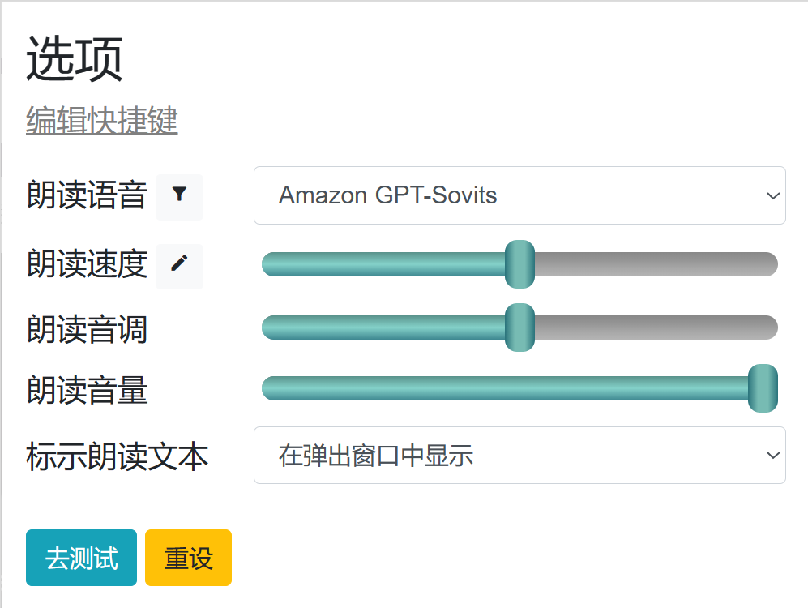

## 基于 https://github.com/ken107/read-aloud/ 修改的支持GPT-SoVits的浏览器扩展

### 使用方法

安装扩展后，添加GPT-SoVits接口地址



## 接口地址

```
http://localhost:9880?refer_wav_path=E:/work/GPT-SoVITS-0211/output/slicer_opt/Keira.wav_0000000000_0000131840.wav&prompt_text=光动嘴不如亲自做给你看，等我一下啊&prompt_language=中文&text_language=中英混合
```




